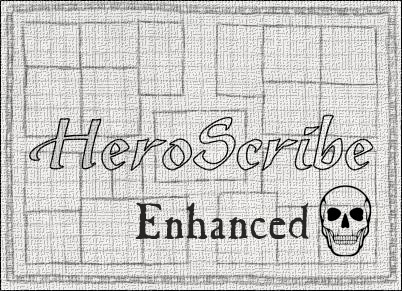
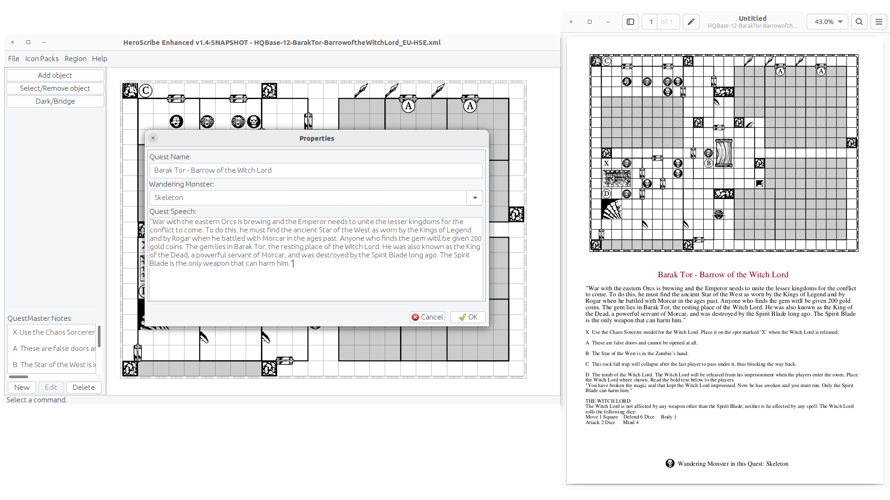

# Heroscribe Enhanced Skull

Changes in HeroScribeEnhanced-1.0, by 2011 Jason Allen.

Using OpenJDK 11 and maven.

Made for home use.

## Building

### Requirements

- OpenJDK 11 - https://jdk.java.net/archive/
- Maven - https://maven.apache.org/

### Using asdf (Linux)

The project includes a .tool-versions for asdf.
See https://asdf-vm.com/ for how to use asdf.

### Build

#### Zin bundle
In the project's root folder:

    make

This will create a `target` folder with a file called `heroscribe-enhanced-skull-bundle.zip`, which contains the HeroScribeEnhanced ready to use.

#### Debian package

    gbp buildpackage --no-sign --git-ignore-branch --git-ignore-new

This will create the debian package in the parent directory. e.g: `../heroscribe-enhanced-skull_1.7_all.deb`

## Running HeroScribe

### Zip bundle

Unzip the bundle and run

    java -jar heroscribe-enhanced-skull.jar

Postscript is required for high quality PDF generation.

### Debian package

Install the debian package in your system

    # apt-get install default-jre-headless ghostscript
    # dpkg -i ../heroscribe-enhanced-skull_1.7_all.deb

In your desktop, go to _Applications -> Graphics -> Heroscribe Enhanced Skull_

## Links

- The original HeroScribe: <http://www.heroscribe.org/heroquest.html>

- The original HeroScribe Enhanced (archived): <https://web.archive.org/web/20170209065300/http://www.propvault.com/heroscribe/>

## Legal

HeroQuest Copyright 1989, 1990 Milton Bradley Company. All Rights Reserved. Nothing on this project is intended as a challenge to the rights of the Milton Bradley Company/Hasbro, Inc. in regard to HeroQuest.
