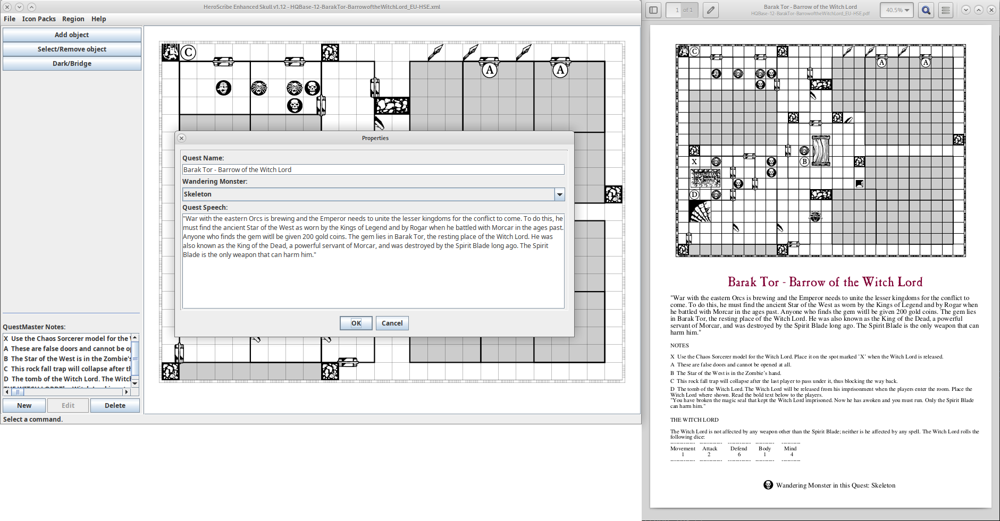

# Heroscribe Enhanced Skull

## What's new in this version of Heroscribe?

- Add your notes to the quest
- Install and remove `Icon Packs` from `https://www.heroscribe.org/icons.html` with a single click

## Examples

- Everyone's a Suspect: [xml](examples/Everyone's%20a%20Suspect.xml), [pdf](examples/Everyone's%20a%20Suspect.pdf)
- Barak Tor - Barrow of the Witch Lord: [xml](examples/HQBase-12-BarakTor-BarrowoftheWitchLord_EU.xml), [pdf](examples/HQBase-12-BarakTor-BarrowoftheWitchLord_EU.pdf)
- Journey to the Bottom of the Crypt: [xml](examples/Journey%20to%20the%20Bottom%20of%20the%20Crypt.xml), [pdf](examples/Journey%20to%20the%20Bottom%20of%20the%20Crypt.pdf)

## How to download

Go to the [releases section](https://github.com/adelolmo/heroscribe/releases/latest) and download the package depending on you OS (for _Debian/Ubuntu_ the `.deb` and for other _Linux distros_, _Win_ and _Mac_ the `.zip`)

## Running HeroScribe

### Zip bundle

Unzip the bundle and run

    java -jar heroscribe-enhanced-skull.jar

Postscript is required for PDF generation.

### Debian package

Install the debian package in your system

    # apt-get install default-jre-headless ghostscript
    # dpkg -i ../heroscribe-enhanced-skull_1.10_all.deb

In your desktop, go to _Applications -> Graphics -> Heroscribe Enhanced Skull_

## Building

### Requirements

- OpenJDK 11 - https://jdk.java.net/archive/
- Maven - https://maven.apache.org/

### Using asdf (Linux)

The project includes a .tool-versions for asdf.
See https://asdf-vm.com/ for how to use asdf.

#### Zip bundle
In the project's root folder:

    make

or

    mvn package -DskipTests

This will create a `target` folder with a file called `heroscribe-enhanced-skull_1.10.zip`, which contains the HeroScribeEnhanced ready to use.

#### Debian package

    gbp buildpackage --no-sign --git-ignore-branch --git-ignore-new

This will create the debian package in the parent directory. e.g: `../heroscribe-enhanced-skull_1.10_all.deb`

## Links

- The original HeroScribe: <http://www.heroscribe.org/heroquest.html>

Changes in HeroScribeEnhanced-1.0, by 2011 Jason Allen.
- The original HeroScribe Enhanced (archived): <https://web.archive.org/web/20170209065300/http://www.propvault.com/heroscribe/>

## Legal

HeroQuest Copyright 1989, 1990 Milton Bradley Company. All Rights Reserved. Nothing on this project is intended as a challenge to the rights of the Milton Bradley Company/Hasbro, Inc. in regard to HeroQuest.
